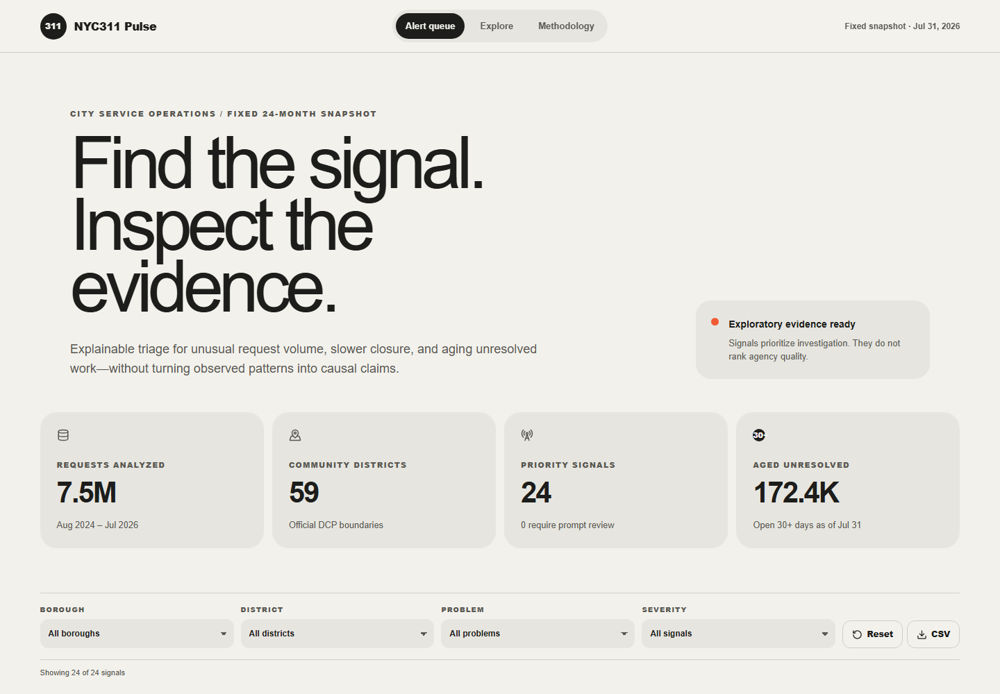
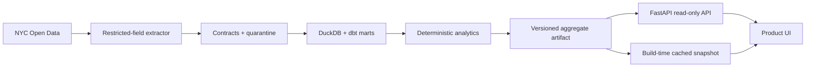

# NYC311 Pulse

**Evidence-first anomaly triage for New York City service operations.** NYC311 Pulse turns a fixed, reproducible snapshot of official 311 data into a public alert queue, Community District map, and inspectable signal evidence. It is a portfolio case study—not a live operations product and not an agency scorecard.

> **Deployment status:** intentionally offline. The repository, reproducible artifact, tests, and recorded walkthrough remain available for review.
>
> [Case study](docs/case-study.md) · [OpenAPI contract](public/openapi.json) · [Download the 45-second MP4 walkthrough](public/demo/nyc311-pulse-demo.mp4)

## Product walkthrough

https://github.com/user-attachments/assets/485fbc47-7448-400e-b447-12d474022e2b

[Download the source MP4](public/demo/nyc311-pulse-demo.mp4)

This is a continuous browser recording—not a screenshot slideshow. It covers cursor movement, scrolling, borough filtering, signal evidence, Community District exploration, district-specific trends, locked-test metrics, and methodology. The hosted demo has been withdrawn; this recording preserves the reviewer experience without requiring a live service.



## What a reviewer can verify in 30 seconds

- **Real scope:** 7,498,437 official requests created from 2024-08-01 through 2026-07-31; extracted on 2026-08-21.
- **Complete aggregates:** 436,266 district/problem/day rows span the declared window, paginate across nine Socrata pages, and reconcile to 4,502,830 selected-category requests.
- **Locked evaluation:** the selected 26-week Negative Binomial detector achieved F1 = 0.823, 4.45 false episodes/week, and zero-day median delay on 1,200 independently seeded events.
- **Two release gates:** the synthetic gate passed; all public candidates remain `research_flag` until the 60-case blind real-history review reaches Precision@20 ≥ 0.65.
- **Privacy by design:** no address, street, coordinates, resolution text, or raw complaint endpoint is present.
- **Accessible fallback:** charts have equivalent tables, the map has a 59-district button interface, and the static snapshot remains usable if the API is unavailable.

## Stack

| Layer | Technology |
| --- | --- |
| Product UI | Next.js-compatible vinext, React 19, strict TypeScript, TanStack Query, MapLibre GL, Vega-Lite |
| API | FastAPI, Pydantic, generated OpenAPI TypeScript types |
| Analytics | Python, pandas, NumPy, Kaplan–Meier utilities, deterministic injection tests |
| Warehouse | DuckDB, dbt-duckdb, quarantines and schema tests |
| Delivery | Cloudflare Worker-compatible frontend, optional FastAPI service, GitHub Actions |
| Quality | Vitest, Testing Library, Playwright, axe, pytest, Ruff, Pyright, ESLint |

## Local development

Requirements: Node.js 22+ and Python 3.11+ (CI targets Python 3.13).

```bash
npm install
python -m venv .venv
.venv/Scripts/python -m pip install -e . --group dev
npm run dev
```

Useful checks:

```bash
npm run typecheck
npm run lint
npm test
npm run build
.venv/Scripts/python -m pytest
.venv/Scripts/ruff check analytics api scripts tests/python
.venv/Scripts/pyright
.venv/Scripts/dbt build --profiles-dir dbt
```

Generate the fixed artifact and API contract:

```bash
.venv/Scripts/python scripts/build_snapshot.py
npm run openapi:generate
```

The request-level extractor in `analytics/socrata.py` supports an app token, pagination, retries, checkpoints, and Pydantic validation. Raw pages belong under ignored `.cache/` or `data/raw/` paths. The public builder uses Socrata server-side aggregates so the demo can be reproduced without publishing millions of request rows.

## Deployment guide

The repository is deliberately not attached to a live deployment. The UI is self-contained: without an API URL it reads the verified aggregate artifact from `public/data/snapshot.json`. The following steps reproduce a deployment when one is needed.

### 1. Prepare the environment

Install Node.js 22+, Python 3.11+, Git, and a Cloudflare account. Clone the repository and install the locked dependencies:

```bash
git clone https://github.com/billylu24/nyc311-pulse.git
cd nyc311-pulse
npm ci
python -m venv .venv
```

Windows PowerShell:

```powershell
.venv\Scripts\python.exe -m pip install -e . --group dev
```

macOS or Linux:

```bash
.venv/bin/python -m pip install -e . --group dev
```

No secret is required to deploy the committed fixed snapshot. Set `SOCRATA_APP_TOKEN` only when rebuilding data from NYC Open Data; keep it in the shell or an ignored `.env` file and never commit it.

### 2. Rebuild artifacts when required

Skip this step to deploy the reviewed snapshot already committed to the repository. To create a new snapshot and regenerate the API contract:

```powershell
$env:SOCRATA_APP_TOKEN = "your-token"
.venv\Scripts\python.exe scripts\build_snapshot.py
npm run openapi:generate
```

The build fails on truncated pagination, missing dates, duplicate aggregate pages, or a mismatch with the independent Socrata count. Review `public/data/manifest.json`, the data-quality section of `public/data/snapshot.json`, and the generated review packet before publishing a rebuilt artifact.

### 3. Run the release checks

```bash
npm run lint
npm run typecheck
npm test
npm run build
npm run test:e2e
```

Windows analytics checks:

```powershell
.venv\Scripts\python.exe -m pytest
.venv\Scripts\ruff.exe check analytics api scripts tests/python
.venv\Scripts\pyright.exe --pythonpath .venv\Scripts\python.exe
.venv\Scripts\dbt.exe build --profiles-dir dbt
npm run openapi:check
```

Do not publish `validated`, `high`, or `watch` alerts unless both the locked synthetic gates and real-history Precision@20 gate pass. A pending human review must remain `revalidation_required` with `research_flag` candidates.

### 4. Deploy the frontend to Cloudflare Workers

The vinext build emits a Worker entry point plus static assets in `dist/`:

```bash
npm run build
npx wrangler login
npx wrangler deploy --config dist/server/wrangler.json
```

Wrangler prints the deployment URL. Test `/`, `/explore`, `/evaluation`, `/methodology`, one `/signals/{id}` page, and `/data/snapshot.json`. Configure a custom domain in Cloudflare only after those checks pass. The default frontend uses the bundled snapshot and does not need the Python API.

### 5. Run or deploy the optional aggregate API

For local API development:

```bash
.venv/bin/uvicorn api.index:app --host 0.0.0.0 --port 8000
```

On Windows use `.venv\Scripts\uvicorn.exe`. Deploy `api/index.py` to a Python ASGI provider if a separately hosted API is desired. Before building the frontend, set:

```bash
NEXT_PUBLIC_API_BASE_URL=https://your-api.example.com
```

Add the frontend origin to `allow_origins` in `api/index.py`, deploy the API, and verify `/healthz`, `/v1/snapshot`, `/v1/signals`, `/v1/trends`, and `/v1/evaluation`. If the API is unavailable, the UI continues to use the committed snapshot.

### 6. Post-deployment checklist

- Confirm the artifact hash matches `public/data/manifest.json`.
- Confirm the model status and all displayed metrics match the README and case study.
- Click every primary navigation item on desktop and mobile.
- Verify keyboard navigation, the accessible chart tables, the district button alternative, and axe checks.
- Confirm no raw request, address, coordinate, free-text complaint, token, or local cache is published.
- Record the deployed commit SHA and artifact version in the release notes.

To regenerate the real browser walkthrough, start the app and record the interaction sequence from a second terminal:

```bash
npm run dev
node scripts/record_walkthrough.mjs
python -m pip install imageio-ffmpeg
python scripts/build_demo_video.py
```

## Architecture



The API exposes aggregate metadata, dimensions, signals, trends, district values, and quality results only. See [architecture.md](docs/architecture.md) and [data-dictionary.md](docs/data-dictionary.md).

## Product boundaries

This project reports observed patterns. It does not infer resident need, agency efficiency, service quality, or causation. `due_date` is excluded because coverage is insufficient for a defensible citywide SLA measure. Joint Interest Areas and `Unspecified` remain in quality analysis but are excluded from the 59-district map ranking.

The fixed snapshot and volume-surge workflow are implemented end to end. The analytical modules also include right-censored closure estimation and dbt closure/open-age marts, but the public model scope is volume only. Synthetic validation does not promote the product by itself: real-history review is still pending and the UI therefore uses research language throughout.

Sources: [NYC Open Data 311 Service Requests](https://data.cityofnewyork.us/resource/erm2-nwe9) and [Community District boundaries](https://data.cityofnewyork.us/City-Government/Community-Districts/5crt-au7u). NYC311 Pulse is an independent portfolio project and is not affiliated with the City of New York.
