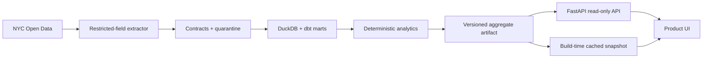

# NYC311 Pulse

**Evidence-first anomaly triage for New York City service operations.** NYC311 Pulse turns a fixed, reproducible snapshot of official 311 data into a public alert queue, Community District map, and inspectable signal evidence. It is a portfolio case study—not a live operations product and not an agency scorecard.

> Live demo: added after the first public deployment · [Case study](docs/case-study.md) · [OpenAPI contract](public/openapi.json)


## What a reviewer can verify in 30 seconds

- **Real scope:** 7,498,437 official requests created from 2024-08-01 through 2026-07-31; extracted on 2026-08-21.
- **Explainable signals:** each production alert compares a day with the median and MAD of eight matching weekdays and uses a stable hashed ID.
- **Honest evaluation:** the current injection backtest produced F1 = 0.057 and 16.31 false alerts/week, so signals are visibly labeled **exploratory**.
- **Privacy by design:** no address, street, coordinates, resolution text, or raw complaint endpoint is present.
- **Accessible fallback:** charts have equivalent tables, the map has a 59-district button interface, and the static snapshot remains usable if the API is unavailable.

## Stack

| Layer | Technology |
| --- | --- |
| Product UI | Next.js-compatible vinext, React 19, strict TypeScript, TanStack Query, MapLibre GL, Vega-Lite |
| API | FastAPI, Pydantic, generated OpenAPI TypeScript types |
| Analytics | Python, pandas, NumPy, Kaplan–Meier utilities, deterministic injection tests |
| Warehouse | DuckDB, dbt-duckdb, quarantines and schema tests |
| Delivery | OpenAI Sites/Cloudflare worker frontend, optional Vercel FastAPI project, GitHub Actions |
| Quality | Vitest, Testing Library, Playwright, axe, pytest, Ruff, Pyright, ESLint |

## Local development

Requirements: Node.js 22+ and Python 3.11+ (CI targets Python 3.13).

```bash
npm install
python -m venv .venv
.venv/Scripts/python -m pip install -e . --group dev
npm run dev
```

Useful checks:

```bash
npm run typecheck
npm run lint
npm test
npm run build
.venv/Scripts/python -m pytest
.venv/Scripts/ruff check analytics api scripts tests/python
.venv/Scripts/pyright
.venv/Scripts/dbt build --profiles-dir dbt
```

Generate the fixed artifact and API contract:

```bash
.venv/Scripts/python scripts/build_snapshot.py
npm run openapi:generate
```

The request-level extractor in `analytics/socrata.py` supports an app token, pagination, retries, checkpoints, and Pydantic validation. Raw pages belong under ignored `.cache/` or `data/raw/` paths. The public builder uses Socrata server-side aggregates so the demo can be reproduced without publishing millions of request rows.

## Architecture



The API exposes aggregate metadata, dimensions, signals, trends, district values, and quality results only. See [architecture.md](docs/architecture.md) and [data-dictionary.md](docs/data-dictionary.md).

## Product boundaries

This project reports observed patterns. It does not infer resident need, agency efficiency, service quality, or causation. `due_date` is excluded because coverage is insufficient for a defensible citywide SLA measure. Joint Interest Areas and `Unspecified` remain in quality analysis but are excluded from the 59-district map ranking.

The fixed snapshot and volume-surge workflow are implemented end to end. The analytical modules also include right-censored closure estimation and dbt closure/open-age marts; the public snapshot currently ships volume signals only because its evaluation target was not met. This is intentionally visible in the UI and case study.

Sources: [NYC Open Data 311 Service Requests](https://data.cityofnewyork.us/resource/erm2-nwe9) and [Community District boundaries](https://data.cityofnewyork.us/City-Government/Community-Districts/5crt-au7u). NYC311 Pulse is an independent portfolio project and is not affiliated with the City of New York.
